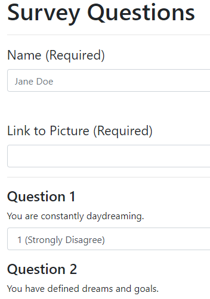
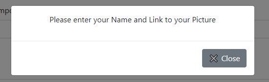
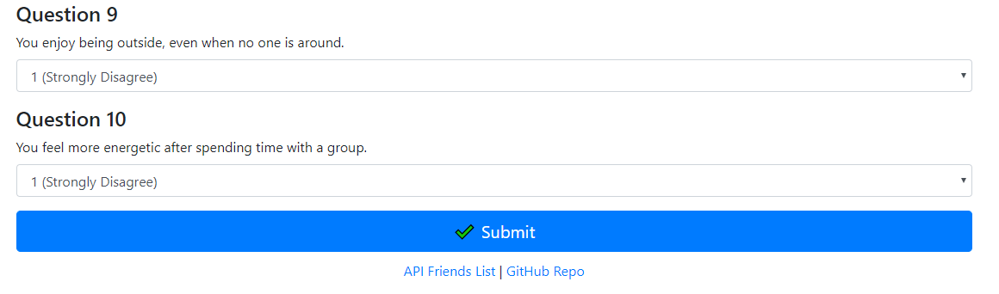
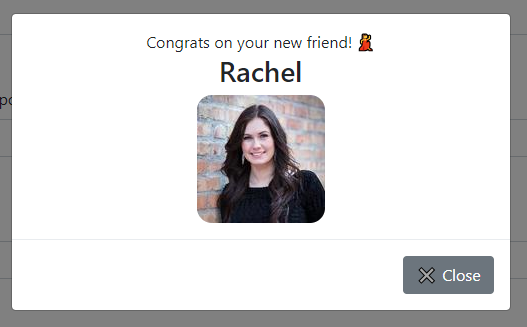

# FriendFinder

Title: LIRI Bot 
Developer: Kevin Flerlage 
Deployment Date: 11/05/18 
For: Northwestern Coding Bootcamp 

## Description

This is a simple app which has users input their name, a photo of them and answer 10 questions about their lives. The homepage is a basic overview of the app and links the user to the survey. On the survey page, the user inputs their name, photo and answers. Once submitted the answers are compared against others who have used the app in the past. The way the app calculates the best match is the difference in the answers the user gave against previous users answers. 

### Homepage

 

The homepage is simple and is more an exercise in using html get routing. From here the user can go to the survey to find a friend or view the current users in the app using the API Friends List.

### Survey

 

The survey page is the core of the functionality of the app. From here the user inputs their name and link to photo. These two fields have validation that they cannot be blank, but there is no way to ensure that the user doesn't input a photo link that isn't actually a link. Below is an example of the validation modal 

 

The answers to questions are ranked 1 (Strongly Disagree) to 5 (Strongly Agree). There is no validation on these as the app automatically defaults the values to 1.

 

Once the user fills out the app and presses submit their answers are compared against the people who have previously inputted their data into the app. The user's answers are compared by taking the difference between their answers and each person in the app. The user is then matched with the person in the app with the most similiar answers. This is displayed as a modal.

 

## Summary

This assignment was challenging to get setup and ensure that everything is working as intended. The logic beind the app was also challenging and ensured that I was thinking of the problem in the correct order. If I was to make improvements to the app, I would make the questions reset when submitting the survey, expanding the friend selection to include location as well as have a link to social media so users matched with people can connect.