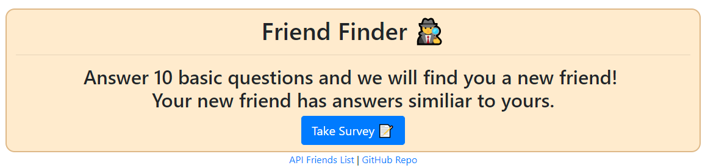

# FriendFinder

Title: LIRI Bot 
Developer: Kevin Flerlage 
Deployment Date: 11/05/18 
For: Northwestern Coding Bootcamp 

## Description

This is a simple app which has users input their name, a photo of them and answer 10 questions about their lives. The homepage is a basic overview of the app and links the user to the survey. On the survey page, the user inputs their name, photo and answers. Once submitted the answers are compared against others who have used the app in the past. The way the app calculates the best match is the difference in the answers the user gave against previous users answers. 

### Homepage

 

The homepage is simple and is more an exercise in using html get routing. From here the user can go to the survey to find a friend or view the current users in the app using the API Friends List.

### Survey